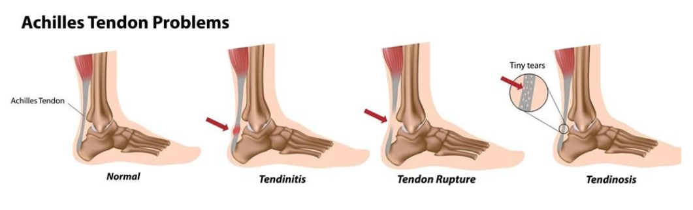

# Tendon Loader

This project is licensed under the MIT license

[![MIT License][license-badge]][license-link]

[license-badge]: https://img.shields.io/github/license/mitulvaghamshi/tendon_loader?logo=%20&style=for-the-badge
[license-link]: https://github.com/mitulvaghamshi/tendon_loader/blob/main/LICENSE

## Introduction
> **Tendon Loader** is a project designned to measure and help overcome with **Achills Tendon Problems**. for more detail see (App Development – V1.pdf) and other documents availale in google drive account for this project.

## Framework used
> This project containing **three** platforms **([Android](https://flutter.dev/docs/get-started/flutter-for/android-devs), [iOS](https://flutter.dev/docs/get-started/flutter-for/ios-devs) and [Web](https://flutter.dev/docs/get-started/flutter-for/web-devs))** built using [Flutter](https://flutter.dev/) with [Firebase](https://console.firebase.google.com/project/tendon-loader/overview).
## Project modules
1. > **Android**: Contains skeleton for basic Android container app, and [configuration](https://console.firebase.google.com/project/tendon-loader/settings/general/android:ca.ubc.tendon_loader) (please download from the firebase console) for the Firebase connectivity.
2. > **iOS**: Same as Android it contains all the resources to build an iOS container app, and [configuretion](https://console.firebase.google.com/project/tendon-loader/settings/general/ios:ca.ubc.tendonLoader) (please download from the firebase console) for the Firebase connectivity.
3. > **Web**: The web module uses [automatic configuration](https://firebase.google.com/docs/hosting/reserved-urls?authuser=0) to connect with the Firebase.
4. > **Firebase**: Firebase is currently registered using [Spark](https://firebase.google.com/pricing?authuser=0) plan. which is free with limited read/write access and suitable for development phase. Project uses three services from the Firebase:
    1. > **Authentication**: Uses the (email only) method to allow user(as a patient) and admin(as a clinician) to login and/or register to the app or web portal.
       > * User can login/register through the app (Android/iOS) only, and does not have access to the web portal.
       > * User can only generate the data and submit it to the clinician (web-portal), and does not allowed to view, alter or delete it leter.
       > * Admin can login/register to both (App/Web) using same credentials, can create new users (admin/non-admin) from the web portal, and can toggle web portal access for existing users.
       > * No implementation for deleting extisting users (except deleting actual database and auth records from the Firebase).
       > * New users/admins are created using **email and password** method, and does not contain email verification and allowed to use (non-existing) dummy email addresses.
       > * All new users(patients) are, to follow unique email/user-id formation, might be created and assigned by the clinician.
    2. > **Firestore Database**: It contains data for both the user and admin.
       > * Every new user and/or admin occupies some on-demand increasing space in this database, and will be used and altered using only the app and/or web throughout the life-cycle of that user/admin.
       > * Database and it's strcture creation is fully managed by the app/web itslef, and does not require prior creation of any component including authentication. It's a plug and play based system.
       > * **Altering or Removing** any existing field from this database might **crash** the app or web portal.
    3. > **Hosting**: The web-app for web module is [hosted](https://console.firebase.google.com/project/tendon-loader/hosting/sites) in [preview channel] during testing period. The official URLs registered for the live channel are:
       > * [https://tendon-loader.web.app/](cors enabled) and
       > * [https://tendon-loader.firebaseapp.com/]
       > * See the (res/cors.json) file to manage cross origin resources access.
## How to begin?
### To start working with this project requires following setup:
* > System: Windows 10 or higher, or macOS Bug Sur 11 or higher (also works with new Apple Silicon SoC).
* > RAM: at least 8GB. (16GB recommanded for smooth performance).
* > Tools and SDKs:
   * > [Flutter](https://flutter.dev/): **First thing First!** Download the latest stable version of the [Flutter SDK](https://flutter.dev/docs/get-started/install) and extract to desired folder. Please follow the official guide on Flutter to successfully install Flutter SDK. (last tested with Flutter v2.2.3-stable and Dart v2.13.0-stable).
   * > [Android Studio](https://developer.android.com/studio): **Required to work with Android!** Download the stable version from the official sile (last tested with Arctic Fox v2020.3.1-stable, Android 12-preview, and Gradle v7.0.2). Follow the basic installation steps to get started. Android build system require to provide keystore information (two files) (that not available in this repo) to be available at this location (android/keystore.properties) and (android/tendonloaderkey.jks) please [get it](mailto:mitulvaghmashi@gmail.com) and paste in root Android folder to successfully build the app and create release versions, *.gitignore* is already configured to not commit those files to version control, make sure to follow this to prevent any missuse. **Alternative**: For the testing perpose (will make unable to create release build) comment out following code lines in app level [build.gradle](android/app/build.gradle) file and rebuild the project:
    ```Gradle
        // Comment out below lines.
        29 def keystorePropertiesFile = rootProject.file("keystore.properties")
        30 def keystoreProperties = new Properties()
        31 keystoreProperties.load(new FileInputStream(keystorePropertiesFile))

        // Comment these lines in signingConfigs's release section.
        54 keyAlias keystoreProperties['keyAlias']
        55 keyPassword keystoreProperties['keyPassword']
        56 storeFile file(keystoreProperties['storeFile'])
        57 storePassword keystoreProperties['storePassword']
    ```
   * > [XCode](https://apps.apple.com/us/app/xcode/id497799835?mt=12): **Required to work with iOS!** Download XCode (use App Store) to test with iOS devices. (last tested with XCOde v12-stable, and iOS 14.5). No further modification required, project uses **New Build System** and XCode-12 code compativility, please adjust in XCode preferences. Also requires **Development License** please create one for testing or use existing one if you alredy have Apple Developer account.
   * > [Visual Studio Code](https://code.visualstudio.com/): **Recommanded!** Download the VS Code to eleminate basic everyday terminal task. Project contains all the required terminal scripts in form of VS Code tasks (can be accessed from Terminal > Run Task... menu item in VS Code when project opened as a workspace (recommanded)). Please see the [workspace file](tendon-loader.code-workspace) for more information about all the available scripts.
   * > [Git](https://git-scm.com/) & [GitHub](https://github.com/): **Required!** Please download git if not already installed, also signup for GitHub if not already done.
   * > [GitHub Desktop](https://desktop.github.com/): **Optional!** It makes easy to work with everyday version control tasks.
   * > [Firebase Emulator](https://firebase.google.com/docs/emulator-suite): **Optional, Recommanded!** During development app needs to communicate with backend all the time, it's better to setup local environment to prevent any data loss and to controll Firebase read/write counts. Follow steps on official firebase docs to setup local emulators.
  ## Next Step
  ### After installing all the required tools and components use either method to setup project.
    ### **Method-1 (Manually)**:
    > Open **tendon_loader** folder in your favorite shell and execute following commands in sequence:
        ```Shell
        tendon_loader $> flutter create .
        /// this will create any missing components if required.

        tendon_loader $> flutter pub get
        /// this will download and integrate

        tendon_loader $> cd ios/
        tendon_loader/ios $> pod install
        tendon_loader/ios $> cd ..
        /// go to the ios directory and install all the pods required

        tendon_loader $> flutter pub run build_runner build --delete-conflicting-outputs
        /// this will generate all the required adapter classes
        ```
    ### **Method-2 (Automatic)**:
    > Use the VS Code to do everything for you, open project in VSCode as a workspace, then Select Run Task... from the Terminal menu and click on **Project: rebuild** tendon-loader.code-workspace item from the list and wait for all the tasks to finish. Use other available items from the list to  perform other tasks, *edit and modify path in this file if required*.

```markdown
> We're still work'n...

> *Found any mistake in this guide? or any suggestion please report or create new issue.
```