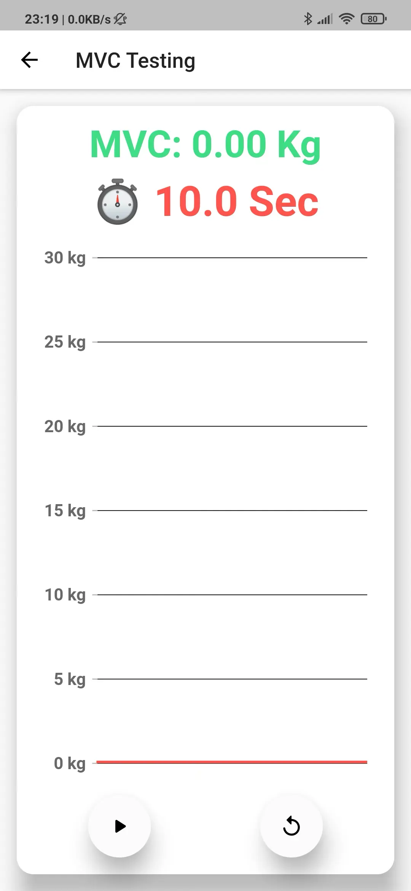

# Tendon Loader

[![MIT License][license-badge]][license-link]

> ## Hey! This project has been concluded on Aug 31, 2021.
>
> Any commits afterwards just code maintainence, including dependencies upgrade,
> framework upgrade, or cleanup, no new feature or support. Thank you.

## Introduction

- **Tendon Loader** is designed to measure and help cure **Achille's
  (uh-KILL-eez) Tendon Problems**.
- Project is built for **Patients** (Android, iOS) and for **Clinician** (Web).
- Mobile Apps uses a [**Low-Energy-Bluetooth**][tindeq-progressor] device called
  [**Tindeq Progressor**][tindeq-progressor] for data measurements.

## Background

- [**Tendon rupture**][tendon-rapture] is an injury that affects the back of
  your lower leg.
- It mainly occurs in people playing recreational sports, but it can happen to
  anyone.
- **The Achilles tendon** is a strong fibrous cord that connects the muscles in
  the back of your calf to your heel bone.


## The Project

- This project contains three platforms ([Android][flutter-android],
  [iOS][flutter-ios] and [Web][flutter-web]) built using [Flutter][flutter-dev]
  with [Firebase][firebase-console].

## Firebase:

- ~~Firebase is currently registered using **Spark** plan. Which is free with
  limited read/write access and suitable for development.~~
- Firebase setup and initialization is managed using
  [flutterfire][flutterfire-cli] command-line tool.

## 1. Authentication

- Uses the (email only) method to allow the User (Patient) and Admin(Clinician)
  to login and/or register to the app or web portal.
- User can login/register through the app (Android/iOS) only, and does not have
  access to the web portal (unless explicitly **Granted by Clinician**).
- User can only record (create) data and submit it to the Clinician through the
  app, and does not allowed to view, alter or delete it later.
- Admin can login/register to both (App/Web) using same credentials, can add new
  users (admin/non-admin) from the web portal, and can provide web portal access
  (if required) to existing users.
- New users/admins are created using **Email and Password** method, and does not
  contain email verification and allowed to use (non-existing) dummy email
  addresses.

## 2. Firestore Database

- Data storage for both the user and admin.
- Database and its structure formation is fully managed by the application
  itself, and does not require any prior creation of any component including
  authentication.
- Altering database structure may result in **App Crash**.

## 3. Hosting

- ~~The web-app is [hosted][web-hosting] URLs registered for the live channel
  are: https://tendon-loader.web.app and https://tendon-loader.firebaseapp.com~~

## Setup

- This Guide assumes you have installed **Flutter SDK**, **Android Studio**,
  **Xcode (macOS)**, and **Google Chrome**
- **Android build** requires keystore information files to successfully build
  the app (even debug mode): (`android/keystore.properties`) and
  (`android/tendonloaderkey.jks`).
- During development, comment out following lines in app level
  [build.gradle](android/app/build.gradle) file and rebuild the project:

```console
sudo npm install -g firebase-tools

firebase login
firebase init

dart pub global activate flutterfire_cli
flutterfire configure

firebase emulators:start --import=<path> --export-on-exit=<path>
```

```Gradle
// Comment out below 3 lines
def keystorePropertiesFile = rootProject.file("keystore.properties")
def keystoreProperties = new Properties()
keystoreProperties.load(new FileInputStream(keystorePropertiesFile))

// And,
signingConfigs {
    release {
        // Comment out these 4 lines
        keyAlias keystoreProperties['keyAlias']
        keyPassword keystoreProperties['keyPassword']
        storeFile file(keystoreProperties['storeFile'])
        storePassword keystoreProperties['storePassword']
    }
}
```

## Firebase Emulator Suite (optional, recommended)

- Emulator suite consists of individual service emulators built to accurately
  mimic the behavior of Firebase services.
- This means you can connect your app directly to these emulators to perform
  integration testing or QA without touching production data.
- Learn more about initializing and running local emulators at:
  [firebase-emulator].

## Code Generation (build_runner)

- Run following command to generate sources in project root

```
flutter pub run build_runner build --delete-conflicting-outputs
```

## Apple M1+ (Fix)

- The `flutter_blue` plugin uses `google protocol buffer` to compile and build
  artifacts.
- However, on **Apple Silicon**, because the plugin depends on old version of
  compiler `protoc-3.11.4`, which is for x86 architecture, presumably as of
  (2021).
- So as a workaround, we specify to use **Rosetta 2** (intel architecture) that
  allows compiler `protoc` to run successfully.
- To update **flutter_blue** plugin,
  - Open project in Android Studio,
  - From the `Project` side panel expand `Gradle Scripts`,
  - Look for module level `gradle.build (Module :flutter_blue)`,
  - Location (macOS):
    (`/Users/<username>/.pub-cache/hosted/pub.dev/flutter_blue-<version>/android/build.gradle`)
  - Open the file and make following changes:

<details>
<summary>The Error</summary>

```
FAILURE: Build completed with 2 failures.

1: Task failed with an exception.
-----------
* What went wrong:
Execution failed for task ':flutter_blue:generateDebugProto'.
> Could not resolve all files for configuration ':flutter_blue:protobufToolsLocator_protoc'.
   > Could not find protoc-3.11.4-osx-aarch_64.exe (com.google.protobuf:protoc:3.11.4).
     Searched in the following locations:
         https://repo.maven.apache.org/maven2/com/google/protobuf/protoc/3.11.4/protoc-3.11.4-osx-aarch_64.exe
```

</details>

<details>
<summary>Old solution of 2021</summary>

```Gradle
protobuf {
    protoc {
        // Replace this line
        artifact = 'com.google.protobuf:protoc:3.11.4'
        // With this block
        if (osdetector.os == "osx") {
          artifact = 'com.google.protobuf:protoc:3.14.0:osx-x86_64'
        } else {
          artifact = 'com.google.protobuf:protoc:3.14.0'
        }
    }
}
```

</details>

```Gradle
// Update dependency to latest version (2023).

protobuf {
    protoc {
        // Replace version: 3.11.4
        artifact = 'com.google.protobuf:protoc:3.11.4'
        // with version: 3.21.7
        artifact = 'com.google.protobuf:protoc:3.21.7'
    }

}

dependencies {
    // Same as above, replace 3.11.4
    implementation 'com.google.protobuf:protobuf-javalite:3.11.4'
    // with 3.27.7
    implementation 'com.google.protobuf:protobuf-javalite:3.21.7'
}
```

## Flutter run key commands.

- **r** - Hot **reload**. 🔥🔥🔥
- **R** - Hot **restart**. ♻️♻️♻️
- **c** - **Clear** the screen.
- **v** - Open Flutter **DevTools**.
- **h** - Repeat this **help** message.
- **g** - Run source **code generators**.
- **d** - Detach (terminate `flutter run` but leave application running).
- **q** - Quit (terminate the application on the device).
- **w** - Dump **widget hierarchy** to the console. (`debugDumpApp`)
- **t** - Dump **rendering tree** to the console. (`debugDumpRenderTree`)
- **L** - Dump **layer tree** to the console. (`debugDumpLayerTree`)
- **S** - Dump **accessibility tree** in **traversal** order.
  (`debugDumpSemantics`)
- **U** - Dump **accessibility tree** in **inverse hit test** order.
- **j** - Dump frame **raster stats** for the current frame. (Unsupported for
  web)
- **M** - Write **SkSL shaders** to a unique file in the project directory.
- **p** - Toggle the display of **construction lines**.
  (`debugPaintSizeEnabled`)
- **i** - Toggle **widget inspector**.
  (`WidgetsApp.showWidgetInspectorOverride`)
- **P** - Toggle **performance overlay**. (`WidgetsApp.showPerformanceOverlay`)
- **a** - Toggle **timeline events** for all widget build methods.
  (`debugProfileWidgetBuilds`)
- **I** - Toggle **oversized image** inversion. (`debugInvertOversizedImages`)
- **b** - Toggle platform **brightness** (dark and light mode).
  (`debugBrightnessOverride`)
- **o** - Simulate different **operating systems**. (`defaultTargetPlatform`)

[Checkout Bluetooth Connection Flow](./Resources/Connection.pdf)

## Screenshots





[license-badge]: https://img.shields.io/github/license/mitulvaghamshi/tendon_loader?logo=%20&style=for-the-badge
[license-link]: https://github.com/mitulvaghamshi/tendon_loader/blob/main/LICENSE
[flutter-android]: https://flutter.dev/docs/get-started/flutter-for/android-devs
[flutter-ios]: https://flutter.dev/docs/get-started/flutter-for/ios-devs
[flutter-web]: https://flutter.dev/docs/get-started/flutter-for/web-devs
[flutter-dev]: https://flutter.dev
[firebase-console]: https://console.firebase.google.com/project/tendon-loader/overview
[firebase-emulator]: https://firebase.google.com/docs/emulator-suite
[tindeq-progressor]: https://tindeq.com
[web-hosting]: https://console.firebase.google.com/project/tendon-loader/hosting/sites
[android-config]: https://console.firebase.google.com/project/tendon-loader/settings/general/android:ca.ubc.tendon_loader
[flutterfire-cli]: https://firebase.flutter.dev/docs/cli
[tendon-repture]: https://www.mayoclinic.org/diseases-conditions/achilles-tendon-rupture/symptoms-causes/syc-20353234
